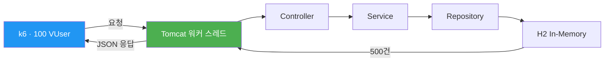
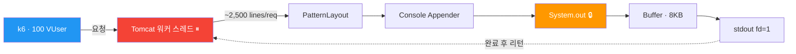
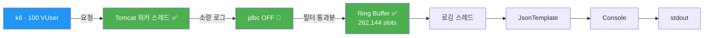
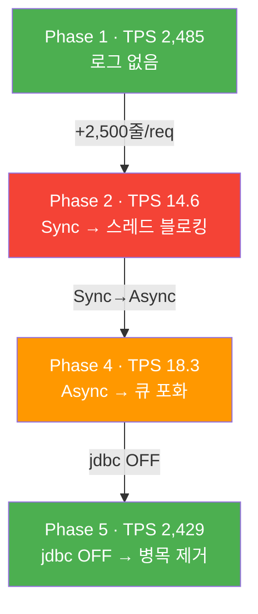

# JVM 로깅이 성능에 미치는 영향 — 5단계 실험

운영 환경에서 `jdbc.resultset` 로그가 **1시간에 34GB(2.7억 건)** 발생하며 CloudWatch 비용이 급증한 사례를 계기로,
로깅 설정이 애플리케이션 성능에 어떤 영향을 미치는지 정량적으로 측정한 실험이다.

---

## 실험 배경

인프라팀에서 운영 환경의 CloudWatch Logs 비용이 비정상적으로 높다는 사실을 공유했다.
원인은 `jdbc.resultset=INFO` 설정으로 인해 1시간에 34GB(2.7억 건)의 로그가 발생하고 있었던 것.
CloudWatch는 **수집된 로그 GB당 과금**되므로, 불필요한 로그는 곧 비용이다.

인프라팀은 각 도메인 개발자들에게 불필요한 INFO 로그를 줄이는 것을 제안했고,
이를 계기로 "로그가 성능에 실제로 얼마나 영향을 주는가?"를 학습 목적으로 실험해 본 것이다.

이 실험은 다음을 검증한다:
- 로그량이 TPS에 미치는 정량적 영향
- 동기/비동기 로깅의 실질적 차이
- Text/JSON 포맷 전환 비용
- JVM 수준의 실제 병목 지점 (GC? I/O?)

---

## 기술 스택

| 구성 요소 | 선택 | 비고 |
|-----------|------|------|
| Java | 21 | |
| Framework | Spring Boot 4.0.3 | |
| DB | H2 In-Memory | DB I/O 변수 제거 |
| Logging | Log4j2 + log4jdbc | |
| Async | LMAX Disruptor 4.0.0 | Log4j2 AsyncLogger용 |
| Load Test | k6 | 100 VUser, 1분 |
| Profiling | VisualVM | CPU, Heap, GC |

---

## 실험 설계

### 테스트 시나리오

- H2에 더미 데이터 **500건** INSERT (앱 시작 시 자동)
- `GET /api/logs/test` → `findAll()`로 500건 전체 조회
- k6로 **100 VUser × 1분** 지속 호출

### 독립 변인 매트릭스

| Phase | Appender | 포맷 | jdbc.resultset | 요청당 로그량 |
|-------|----------|------|----------------|-------------|
| 1 | - (OFF) | - | OFF | 0줄 |
| 2 | Sync Console | Text (PatternLayout) | **ON** | ~2,500줄 |
| 3 | Sync Console | JSON (JsonTemplateLayout) | **ON** | ~2,500줄 |
| 4 | **Async** (Disruptor) | JSON | **ON** | ~2,500줄 |
| 5 | **Async** (Disruptor) | JSON | **OFF** | 0줄 |

### 통제 변인

- H2 In-Memory DB → 네트워크/디스크 I/O 변수 제거
- 동일 API, 동일 데이터, 동일 부하 조건
- Spring Profile로 설정만 전환 (`-Dspring.profiles.active=phaseN`)

---

## 실험 결과

### 1차 실험: jdbc.resultset (극단적 로그 폭탄)

| Phase | 설정 요약 | TPS | avg (ms) | p95 (ms) | Baseline 대비 |
|-------|----------|-----|----------|----------|---------------|
| 1 | Baseline (로깅 OFF) | **2,485** | 40.18 | 173.37 | 100% |
| 2 | Sync + Text + jdbc.resultset ON | **14.6** | 6,510 | 7,180 | 0.59% |
| 3 | Sync + JSON + jdbc.resultset ON | **13.5** | 7,000 | 7,600 | 0.54% |
| 4 | Async + JSON + jdbc.resultset ON | **18.3** | 5,240 | 5,720 | 0.74% |
| 5 | Async + JSON + jdbc.resultset OFF | **2,429** | 41.12 | 176.62 | 97.7% |

```
TPS
2,500 ┤██████████████████████████████████████████████████ Phase 1 (2,485)
2,400 ┤████████████████████████████████████████████████   Phase 5 (2,429)
      │
      │
  100 ┤
   18 ┤▊                                                 Phase 4 (18.3)
   15 ┤▋                                                 Phase 2 (14.6)
   14 ┤▋                                                 Phase 3 (13.5)
      └──────────────────────────────────────────────────
```

#### 관찰

- **Phase 1→2**: TPS **170배 폭락** (2,485 → 14.6). jdbc.resultset이 요청당 2,500+줄 로그를 생성하며 스레드를 마비시킴
- **Phase 2→3**: 차이 미미 (7.5%). I/O 블로킹이 지배적이라 JSON 직렬화 비용이 묻힘
- **Phase 3→4**: 35% 회복이지만 여전히 Baseline의 0.74%. 로그량이 극단적이라 Async도 한계
- **Phase 4→5**: TPS 18.3 → 2,429로 **Baseline 97.7% 회복**. 원천 차단이 유일한 해결책

### 2차 실험: jdbc.sqltiming (적정 수준의 로그)

jdbc.resultset 대신 **jdbc.sqltiming**(요청당 1~2줄)으로 로그량을 줄여 Phase 간 차이를 확인.

| Phase | 설정 요약 | TPS | avg (ms) | p95 (ms) | Baseline 대비 |
|-------|----------|-----|----------|----------|---------------|
| 1 | Baseline (로깅 OFF) | **2,485** | 40.18 | 173.37 | 100% |
| 2b | Sync + Text + jdbc.sqltiming ON | **1,955** | 51.08 | 209.81 | 78.7% |
| 3b | Sync + JSON + jdbc.sqltiming ON | **1,982** | 50.39 | 204.87 | 79.8% |
| 4b | Async + JSON + jdbc.sqltiming ON | **2,004** | 49.83 | 202.52 | 80.6% |

로그량이 적정하면 Sync/Async, Text/JSON 간 차이가 **오차 범위** 수준으로 수렴한다.

---

## 데이터 플로우

### Phase 1: Baseline (로깅 OFF)



**TPS 2,485** — 로그 I/O가 없으므로 스레드가 100% 비즈니스 로직에 집중.

### Phase 2: 동기(Sync) + Console



**병목: `System.out` (synchronized)** — `PrintStream.println()`이 내부적으로 `synchronized` 블록. 200개 스레드가 하나의 lock을 놓고 경합하며, 쓰기 완료까지 수백ms 블로킹.

**TPS 14.6** (Baseline 대비 0.59%)

### Phase 4: 비동기(Async) + Console

```mermaid
flowchart LR
    Client["k6 · 100 VUser"] -->|"요청"| T["Tomcat 워커 스레드"]
    T -->|"~2,500 events"| RB["Ring Buffer ⚠️\n262,144 slots"]
    RB -->|"dequeue"| LT["로깅 스레드"]
    LT --> JTL["JsonTemplateLayout"]
    JTL --> CA["Console Appender"]
    CA --> SOUT["System.out 🔒"]
    SOUT --> FD["stdout fd=1"]
    RB -.->|"큐 full → 블로킹"| T

    style T fill:#FF9800,color:#fff
    style RB fill:#FF5722,color:#fff
    style SOUT fill:#FF9800,color:#fff
    style Client fill:#2196F3,color:#fff
```



**병목: Ring Buffer 포화 → back-pressure** — 100 VUser × 2,500 이벤트/요청 = 순식간에 262,144 슬롯 포화. 큐가 차면 Tomcat 워커 스레드도 블로킹.

**TPS 18.3** (Phase 2 대비 +25%, 여전히 Baseline의 0.74%)

### Phase 5: 비동기(Async) + jdbc OFF



**병목 없음** — jdbc.resultset OFF → 요청당 2,500줄 → 0줄. Ring Buffer 여유 충분, back-pressure 없음.

**TPS 2,429** (Baseline의 97.7% 회복)

### Phase 흐름 요약



---

## VisualVM 프로파일링

Phase 2, 4, 5를 VisualVM으로 모니터링했다.

### 예상과 다른 결과: GC는 범인이 아니었다

실험 전 가설은 "대량의 로그 String 객체가 힙 Eden 영역을 채우고 Minor GC가 빈번하게 발생한다"였다.

**실제 결과:**

| Phase | GC 활동 | CPU 사용률 | 힙 톱니 패턴 |
|-------|---------|-----------|-------------|
| 2 (Sync) | 거의 없음 | 낮음 | 없음 |
| 4 (Async) | 0.1~0.3% | 낮음 | 없음 |
| 5 (jdbc OFF) | 없음 | Phase 2 대비 ~20% 높음 | 없음 |

### Phase 2 (Sync + jdbc.resultset ON)

<!-- TODO: VisualVM 스크린샷 추가 -->


동기 로깅이라 스레드가 콘솔에 로그를 다 쓸 때까지 블로킹. 블로킹 중에는 새 요청을 처리하지 못하므로 객체 생성 자체가 일어나지 않는다. TPS가 14밖에 안 되니 **힙에 부담을 줄 만큼의 객체가 만들어지지 않은 것**이다.

### Phase 4 (Async + jdbc.resultset ON)

<!-- TODO: VisualVM 스크린샷 추가 -->


비동기라 메인 스레드는 블로킹되지 않지만, Disruptor 큐가 금방 가득 차면서 back-pressure가 발생. TPS 18 수준이라 **객체 생성률이 GC를 자극할 만큼 높지 않았다**.

### Phase 5 (Async + jdbc OFF)

<!-- TODO: VisualVM 스크린샷 추가 -->


TPS 2,429로 초당 2,000건 이상을 실제로 처리하므로 CPU를 더 많이 사용하는 것이 당연하다. Phase 2는 스레드가 I/O 대기 상태라 **CPU를 오히려 덜 쓰고 있었다**.

### 진짜 병목: I/O 블로킹

이 실험에서 성능을 죽인 것은 GC가 아니라 **콘솔 출력(System.out)의 동기 I/O 블로킹**이다. Tomcat 워커 스레드가 로그를 콘솔에 쓰는 동안 완전히 멈추면서 TPS가 170배 폭락한 것이다.

---

## 결론

### 수치가 말하는 것

| 비교 | TPS 변화 | 핵심 |
|------|---------|------|
| Phase 2→4 (아키텍처 변경) | 14.6 → 18.3 **(+25%)** | Async 전환 효과 |
| Phase 4→5 (로그량 제어) | 18.3 → 2,429 **(+13,200%)** | 원천 차단 효과 |

**아키텍처 최적화(+25%) < 로그량 제어(+13,200%)**

### 핵심 교훈

1. **로그량이 본질이다.** jdbc.resultset(2,500줄/req) → TPS 99.4% 폭락. jdbc.sqltiming(1~2줄/req) → TPS 21% 하락. 같은 "로그를 켰다"라도 양에 따라 하늘과 땅 차이.

2. **병목은 GC가 아니라 I/O다.** VisualVM 프로파일링 결과, 힙이나 GC는 문제가 아니었다. `System.out`의 `synchronized` 블록이 스레드를 블로킹하여 요청 처리를 멈춘 것이 근본 원인.

3. **Sync/Async, Text/JSON은 극단적 상황에서만 의미 있다.** 로그량이 적정하면 차이가 미미하고, 극단적이면 어떤 최적화도 한계가 있다.

4. **원천 차단이 유일한 해결책이다.** Phase 5에서 jdbc.resultset을 OFF 하자 TPS 97.7% 회복. 비동기 로깅은 보험이지 해결책이 아니다.

> 찍지 말아야 할 로그를 원천 차단하는 것이 1순위이고,
> 비동기 로깅/JSON 포맷 최적화는 그 다음 문제다.
> 환경별 로깅 전략을 Spring Profile로 분리하여 운영 환경에 개발용 설정이 배포되지 않도록 시스템적으로 강제해야 한다.

---

## 프로젝트 구조

```
logging-lab/
├── docs/
│   ├── experiment-plan.md        # 실험 계획서
│   ├── experiment-results.md     # 상세 실험 결과
│   ├── data-flow.md              # 데이터 플로우 다이어그램
│   ├── concepts.md               # 핵심 개념 정리
│   └── images/                   # VisualVM 스크린샷
│       ├── visualvm-phase2.png
│       ├── visualvm-phase4.png
│       └── visualvm-phase5.png
├── src/main/java/com/example/logginglab/
│   ├── LoggingLabApplication.java
│   ├── config/
│   │   └── DataInitializer.java  # 더미 500건 INSERT
│   ├── controller/
│   │   └── LogTestController.java # GET /api/logs/test
│   ├── entity/
│   │   └── DummyEntity.java
│   ├── repository/
│   │   └── DummyRepository.java
│   └── service/
│       └── DummyService.java     # findAll()
├── src/main/resources/
│   ├── application.properties
│   ├── application-phase{1~5}.properties
│   ├── log4j2-phase{1~5}.xml    # Phase별 Log4j2 설정
│   └── log4jdbc.log4j2.properties
├── k6/
│   └── load-test.js              # 부하 테스트 스크립트
├── build.gradle.kts
└── settings.gradle.kts
```

## 실행 방법

### 사전 요구사항

- Java 21+
- k6 (`brew install k6`)
- VisualVM (`brew install --cask visualvm`) — 프로파일링 시

### 실험 실행

```bash
# 1. 앱 실행 (Phase 번호만 변경)
./gradlew bootRun -Dspring.profiles.active=phase1

# 2. 별도 터미널에서 k6 부하 테스트
k6 run k6/load-test.js
```

| Phase | Profile | 설명 |
|-------|---------|------|
| 1 | `phase1` | Baseline (로깅 OFF) |
| 2 | `phase2` | Sync + Text + jdbc.resultset ON |
| 3 | `phase3` | Sync + JSON + jdbc.resultset ON |
| 4 | `phase4` | Async + JSON + jdbc.resultset ON |
| 5 | `phase5` | Async + JSON + jdbc.resultset OFF |
| 2b | `phase2b` | Sync + Text + jdbc.sqltiming ON |
| 3b | `phase3b` | Sync + JSON + jdbc.sqltiming ON |
| 4b | `phase4b` | Async + JSON + jdbc.sqltiming ON |
