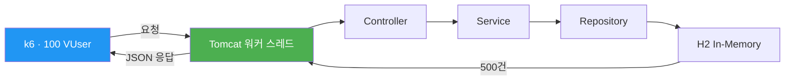
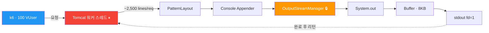
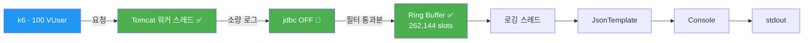
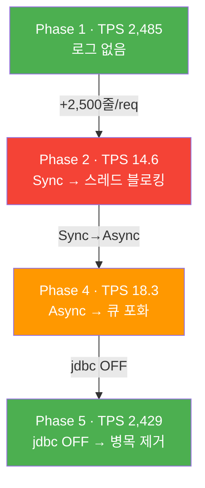
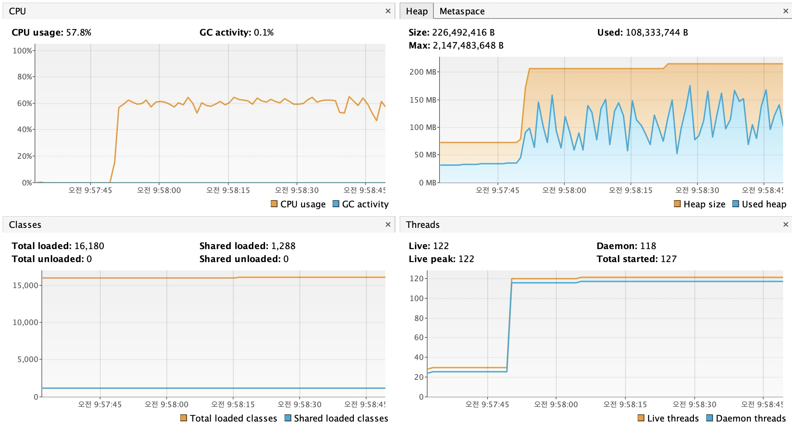
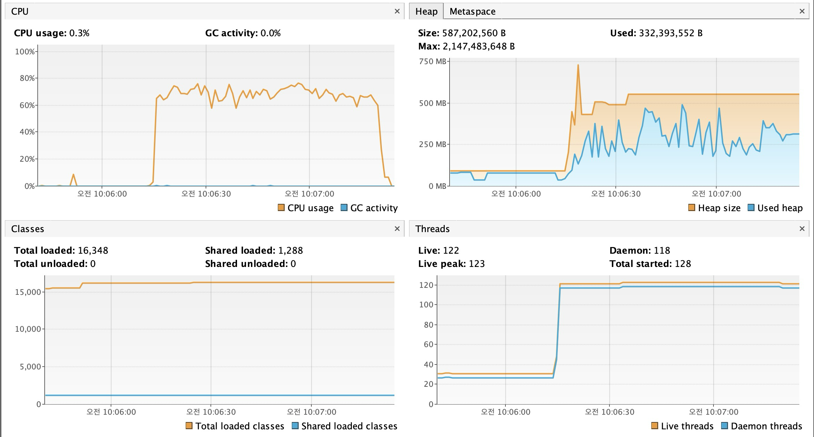
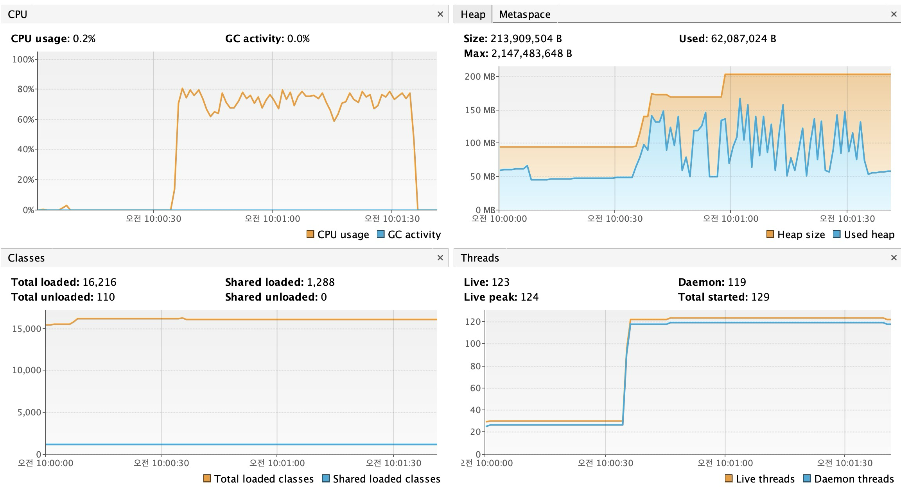

# JVM 로깅이 성능에 미치는 영향 — 5단계 실험

운영 환경에서 `jdbc.resultset=INFO` 설정으로 1시간에 34GB(2.7억 건)의 로그가 발생하며 CloudWatch 비용이 급증한 사례가 있었다.
이를 계기로 로깅 설정이 애플리케이션 성능에 미치는 영향을 정량적으로 측정했다.

---

## 실험 배경

인프라팀에서 운영 환경의 CloudWatch Logs 비용이 비정상적으로 높다는 사실을 공유했다.
원인은 `jdbc.resultset=INFO` 설정으로 인해 1시간에 34GB의 로그가 발생하고 있었던 것이다.
CloudWatch는 수집된 로그 GB당 과금되므로, 불필요한 로그가 비용에 직결된다.

인프라팀은 각 도메인 개발자들에게 불필요한 INFO 레벨 로그를 줄이는 것을 제안했고,
이를 계기로 로그가 성능에 어떤 영향을 미치는지 학습 목적으로 실험했다.

측정 항목:
- 로그량에 따른 TPS 변화
- 동기/비동기 로깅 방식에 따른 차이
- Text/JSON 포맷 전환에 따른 차이
- JVM 수준의 병목 지점 (GC vs I/O)

---

## 기술 스택

| 구성 요소 | 선택 | 비고 |
|-----------|------|------|
| Java | 21 | |
| Framework | Spring Boot 4.0.3 | |
| DB | H2 In-Memory | DB I/O 변수 제거 |
| Logging | Log4j2 + log4jdbc | |
| Async | LMAX Disruptor 4.0.0 | Log4j2 AsyncLogger용 |
| Load Test | k6 | 100 VUser, 30초~1분 |
| Profiling | VisualVM | CPU, Heap, GC |
| Thread Dump | jstack (JDK 내장) | 부하 중 스레드 상태·lock 경합 분석 |

---

## 실험 설계

### 테스트 시나리오

- H2에 더미 데이터 **500건** INSERT (앱 시작 시 자동)
- `GET /api/logs/test` → `findAll()`로 500건 전체 조회
- k6로 **100 VUser × 1분** 지속 호출

### 독립 변인 매트릭스

| Phase | Appender | 포맷 | jdbc.resultset | 요청당 로그량 |
|-------|----------|------|----------------|-------------|
| 1 | - (OFF) | - | OFF | 0줄 |
| 2 | Sync Console | Text (PatternLayout) | ON | ~2,500줄 |
| 3 | Sync Console | JSON (JsonTemplateLayout) | ON | ~2,500줄 |
| 4 | Async (Disruptor) | JSON | ON | ~2,500줄 |
| 5 | Async (Disruptor) | JSON | OFF | 0줄 |

### 통제 변인

- H2 In-Memory DB 사용으로 네트워크/디스크 I/O 변수 제거
- 동일 API, 동일 데이터, 동일 부하 조건
- Spring Profile로 로깅 설정만 전환 (`-Dspring.profiles.active=phaseN`)

---

## 실험 결과

### 1차 실험: jdbc.resultset (요청당 ~2,500줄)

| Phase | 설정 요약 | TPS | avg (ms) | p95 (ms) | Baseline 대비 |
|-------|----------|-----|----------|----------|---------------|
| 1 | Baseline (로깅 OFF) | **2,485** | 40.18 | 173.37 | 100% |
| 2 | Sync + Text + jdbc.resultset ON | **14.6** | 6,510 | 7,180 | 0.59% |
| 3 | Sync + JSON + jdbc.resultset ON | **13.5** | 7,000 | 7,600 | 0.54% |
| 4 | Async + JSON + jdbc.resultset ON | **18.3** | 5,240 | 5,720 | 0.74% |
| 5 | Async + JSON + jdbc.resultset OFF | **2,429** | 41.12 | 176.62 | 97.7% |

```
TPS
2,500 ┤██████████████████████████████████████████████████ Phase 1 (2,485)
2,400 ┤████████████████████████████████████████████████   Phase 5 (2,429)
      │
      │
  100 ┤
   18 ┤▊                                                 Phase 4 (18.3)
   15 ┤▋                                                 Phase 2 (14.6)
   14 ┤▋                                                 Phase 3 (13.5)
      └──────────────────────────────────────────────────
```

#### 관찰

- **Phase 1→2**: TPS 2,485 → 14.6으로 약 170배 감소. jdbc.resultset이 요청당 2,500+줄의 로그를 생성하면서 스레드가 I/O에 블로킹됨
- **Phase 2→3**: TPS 14.6 → 13.5로 차이 미미 (7.5%). I/O 블로킹이 지배적인 상황에서 JSON 직렬화 비용은 측정되지 않음
- **Phase 3→4**: TPS 13.5 → 18.3으로 약 35% 증가. 그러나 Baseline 대비 여전히 0.74%로, 로그량이 극단적인 조건에서는 Async 전환만으로는 한계가 있음
- **Phase 4→5**: TPS 18.3 → 2,429로 Baseline의 97.7% 수준까지 회복. jdbc.resultset을 OFF 하자 로그 I/O 부하가 사라짐

### 2차 실험: jdbc.sqltiming (요청당 1~2줄)

jdbc.resultset 대신 **jdbc.sqltiming**(요청당 1~2줄)으로 로그량을 줄여 Phase 간 차이가 드러나는지 확인.

| Phase | 설정 요약 | TPS | avg (ms) | p95 (ms) | Baseline 대비 |
|-------|----------|-----|----------|----------|---------------|
| 1 | Baseline (로깅 OFF) | **2,485** | 40.18 | 173.37 | 100% |
| 2b | Sync + Text + jdbc.sqltiming ON | **1,955** | 51.08 | 209.81 | 78.7% |
| 3b | Sync + JSON + jdbc.sqltiming ON | **1,982** | 50.39 | 204.87 | 79.8% |
| 4b | Async + JSON + jdbc.sqltiming ON | **2,004** | 49.83 | 202.52 | 80.6% |

이 조건에서는 Sync/Async, Text/JSON 간 TPS 차이가 오차 범위 수준이었다.

---

## 데이터 플로우

### Phase 1: Baseline (로깅 OFF)



TPS 2,485. 로그 I/O가 없으므로 스레드가 요청 처리에만 사용됨.

### Phase 2: 동기(Sync) + Console



TPS 14.6 (Baseline 대비 0.59%). Log4j2 `OutputStreamManager`의 `synchronized` 블록에서 Tomcat 워커 스레드들이 하나의 lock을 놓고 경합하며, 쓰기 완료까지 블로킹됨. 스레드 덤프로 확인한 lock 경합 지점은 `OutputStreamManager.writeBytes()`와 `OutputStreamManager.flush()`다.

### Phase 4: 비동기(Async) + Console

```mermaid
flowchart LR
    Client["k6 · 100 VUser"] -->|"요청"| T["Tomcat 워커 스레드"]
    T -->|"~2,500 events"| RB["Ring Buffer ⚠️\n262,144 slots"]
    RB -->|"dequeue"| LT["로깅 스레드"]
    LT --> JTL["JsonTemplateLayout"]
    JTL --> CA["Console Appender"]
    CA --> SOUT["System.out 🔒"]
    SOUT --> FD["stdout fd=1"]
    RB -.->|"큐 full → 블로킹"| T

    style T fill:#FF9800,color:#fff
    style RB fill:#FF5722,color:#fff
    style SOUT fill:#FF9800,color:#fff
    style Client fill:#2196F3,color:#fff
```



TPS 18.3 (Phase 2 대비 +25%, Baseline 대비 0.74%). Disruptor Ring Buffer(262,144 슬롯)가 로그 이벤트를 비동기로 처리하지만, 100 VUser × 2,500 이벤트/요청으로 큐가 포화되면 Tomcat 워커 스레드도 enqueue에서 블로킹됨.

### Phase 5: 비동기(Async) + jdbc OFF



TPS 2,429 (Baseline의 97.7%). jdbc.resultset OFF로 요청당 로그가 0줄이 되면서 Ring Buffer 포화 없이 정상 처리됨.

### Phase 흐름 요약



---

## VisualVM 프로파일링

Phase 2, 4, 5를 VisualVM으로 모니터링했다.

### 가설과 실제 결과

실험 전 가설은 "대량의 로그 String 객체가 힙 Eden 영역을 채우고 Minor GC가 빈번하게 발생한다"였다.

실제 결과는 이와 달랐다:

| Phase | GC 활동 | CPU 사용률 | 힙 사용량 |
|-------|---------|-----------|----------|
| 2 (Sync) | 0.1% | ~58% | ~108MB |
| 4 (Async) | 0.0~0.3% | ~65-75% | ~332MB (변동 있음) |
| 5 (jdbc OFF) | 0.0% | ~70-80% | ~62MB |

### Phase 2 (Sync + jdbc.resultset ON)



CPU 57.8%, GC activity 0.1%. 동기 로깅으로 스레드가 콘솔 출력 완료까지 블로킹되므로 TPS가 14 수준에 머물렀다. TPS가 낮기 때문에 객체 생성률도 낮아 GC 활동이 거의 관찰되지 않았다.

### Phase 4 (Async + jdbc.resultset ON)



CPU 65~75%, GC activity 0.0~0.3%. 비동기 처리로 메인 스레드는 블로킹되지 않지만, Disruptor 큐 포화로 back-pressure가 발생했다. 힙 사용량이 Phase 2 대비 높고 변동이 있는데, Ring Buffer에 로그 이벤트 객체가 쌓이면서 메모리를 더 사용한 것으로 보인다. 그럼에도 GC 활동은 미미했다.

### Phase 5 (Async + jdbc OFF)



CPU 70~80%, GC activity 0.0%. Phase 2보다 CPU 사용률이 약 20% 높은데, TPS 2,429로 초당 2,000건 이상을 실제로 처리하고 있으므로 CPU를 더 사용하는 것이 자연스럽다. Phase 2는 스레드가 I/O 대기 상태에 있었기 때문에 오히려 CPU를 덜 사용하고 있었다.

### 관찰된 병목

VisualVM만으로는 병목의 정확한 위치를 특정할 수 없었다. GC가 원인이 아니라는 것은 확인되었으나, 실제로 스레드가 어디서 블로킹되는지는 VisualVM의 CPU/Heap 모니터링으로는 보이지 않았다. 이 한계를 해소하기 위해 스레드 덤프 분석을 추가로 수행했다.

---

## 스레드 덤프 분석

### 목적

VisualVM 프로파일링에서 GC가 병목이 아님을 확인한 뒤, 실제 스레드가 어디서 블로킹되는지 특정하기 위해 `jstack`으로 스레드 덤프를 수집했다.

### 방법

Phase 2(Sync + jdbc.resultset ON)와 Phase 5(Async + jdbc OFF)에서 각각 k6 부하(100 VUser, 30초)를 건 상태에서, 부하 시작 10초 후 `jstack`으로 스레드 덤프를 캡처했다.

```bash
# 앱 실행
./gradlew bootRun --args='--spring.profiles.active=phase2 --server.port=8081'

# 별도 터미널에서 k6 부하
k6 run k6/load-test.js

# 부하 중 스레드 덤프 캡처
jstack <PID> > docs/thread-dump-phase2.txt
```

### 결과

#### 스레드 상태 비교

| | Phase 2 (Sync + jdbc ON) | Phase 5 (Async + jdbc OFF) |
|---|---|---|
| TPS | 13.3 | 2,653 |
| BLOCKED | **7** | **0** |
| RUNNABLE | 15 | 31 |
| WAITING / TIMED_WAITING | 97 | 90 |

#### Phase 2: lock 경합 상세

BLOCKED 상태의 7개 스레드는 전부 Tomcat 워커 스레드(`http-nio-exec-*`)이며, 동일한 `OutputStreamManager` 인스턴스 하나를 대상으로 lock 경합이 발생했다.

```
"http-nio-8081-exec-92" #133 daemon prio=5
   java.lang.Thread.State: BLOCKED (on object monitor)
	at o.a.l.l.c.appender.OutputStreamManager.writeBytes(OutputStreamManager.java:365)
	- waiting to lock <0x00000007ffd6ced8> (a o.a.l.l.c.appender.OutputStreamManager)
	at o.a.l.l.c.layout.TextEncoderHelper.writeEncodedText(TextEncoderHelper.java:101)
	at o.a.l.l.c.layout.PatternLayout.encode(PatternLayout.java:239)
	at o.a.l.l.c.appender.AbstractOutputStreamAppender.directEncodeEvent(...)
	at o.a.l.l.c.appender.AbstractOutputStreamAppender.tryAppend(...)
	...
	at net.sf.log4jdbc.log.slf4j.Slf4jSpyLogDelegator.methodReturned(...)
```

lock을 잡고 있는 스레드 1개는 같은 `OutputStreamManager`에서 `flushBuffer()` → `flush()`를 수행 중이었다.

```
- locked <0x00000007ffd6ced8> (a o.a.l.l.c.appender.OutputStreamManager)
  at o.a.l.l.c.appender.OutputStreamManager.flushBuffer(OutputStreamManager.java:296)
- locked <0x00000007ffd6ced8> (a o.a.l.l.c.appender.OutputStreamManager)
  at o.a.l.l.c.appender.OutputStreamManager.flush(OutputStreamManager.java:307)
```

콜 체인 정리:

```
Tomcat 워커 스레드
  → log4jdbc (Slf4jSpyLogDelegator.methodReturned)
    → SLF4J → Log4j2 Logger.log()
      → AppenderControl.callAppender()
        → AbstractOutputStreamAppender.tryAppend()
          → OutputStreamManager.writeBytes()  ← 🔒 lock 경합 지점 1
          → OutputStreamManager.flush()       ← 🔒 lock 경합 지점 2
            → System.out (stdout fd=1)
```

#### Phase 5: lock 경합 없음

BLOCKED 스레드 0개. Tomcat 워커 스레드 대부분이 RUNNABLE 상태로 요청 처리에 집중하고 있었다.

### 정정 사항

초기 분석에서는 `System.out`(`PrintStream`)의 `synchronized` 블록을 병목 지점으로 기술했으나, 스레드 덤프 확인 결과 실제 첫 번째 lock 경합 지점은 Log4j2의 `OutputStreamManager`였다. `System.out`의 `synchronized`도 그 아래에서 관여하지만, 스레드가 BLOCKED 상태로 잡히는 지점은 `OutputStreamManager.writeBytes()`와 `OutputStreamManager.flush()`다.

---

## 분석 요약

### 수치 비교

| 비교 | TPS 변화 | 내용 |
|------|---------|------|
| Phase 2→4 (Sync→Async) | 14.6 → 18.3 (+25%) | 아키텍처 변경 효과 |
| Phase 4→5 (jdbc OFF) | 18.3 → 2,429 (+13,200%) | 로그량 제거 효과 |

### 관찰 사항

1. **로그량에 따라 TPS 영향이 크게 달라졌다.** jdbc.resultset(2,500줄/req)에서는 TPS가 99.4% 감소했고, jdbc.sqltiming(1~2줄/req)에서는 21% 감소했다.

2. **이 실험에서 GC는 병목이 아니었다.** VisualVM 프로파일링 결과, GC 활동은 모든 Phase에서 미미했다. TPS가 낮아 객체 생성률 자체가 GC를 유발할 수준에 도달하지 못했다. 스레드 덤프 분석 결과, Log4j2 `OutputStreamManager`의 `synchronized` 블록에서 Tomcat 워커 스레드들이 lock 경합으로 BLOCKED되는 것이 주된 성능 저하 요인이었다.

3. **로그량이 극단적인 조건에서는 Sync/Async, Text/JSON 간 차이가 작았다.** Phase 2~4 모두 TPS 13~18 범위에 머물렀다. 반대로 로그량이 적정한 2차 실험(jdbc.sqltiming)에서도 세 설정 간 차이는 오차 범위였다.

4. **jdbc.resultset OFF로 TPS가 Baseline의 97.7%까지 회복되었다.** Phase 4→5 전환은 로깅 설정 한 줄 변경이었지만, TPS 변화폭은 아키텍처 전환(Phase 2→4)보다 수백 배 컸다.

---

## 프로젝트 구조

```
logging-lab/
├── docs/
│   ├── experiment-plan.md        # 실험 계획서
│   ├── experiment-results.md     # 상세 실험 결과
│   ├── data-flow.md              # 데이터 플로우 다이어그램
│   ├── concepts.md               # 핵심 개념 정리
│   ├── thread-dump-phase2.txt    # Phase 2 스레드 덤프 (k6 부하 중 캡처)
│   ├── thread-dump-phase5.txt    # Phase 5 스레드 덤프 (k6 부하 중 캡처)
│   └── images/                   # VisualVM 스크린샷
│       ├── visualvm-phase2.png
│       ├── visualvm-phase4.png
│       └── visualvm-phase5.png
├── src/main/java/com/example/logginglab/
│   ├── LoggingLabApplication.java
│   ├── config/
│   │   └── DataInitializer.java  # 더미 500건 INSERT
│   ├── controller/
│   │   └── LogTestController.java # GET /api/logs/test
│   ├── entity/
│   │   └── DummyEntity.java
│   ├── repository/
│   │   └── DummyRepository.java
│   └── service/
│       └── DummyService.java     # findAll()
├── src/main/resources/
│   ├── application.properties
│   ├── application-phase{1~5,2b~4b}.properties
│   ├── log4j2-phase{1~5,2b~4b}.xml
│   └── log4jdbc.log4j2.properties
├── k6/
│   └── load-test.js              # 부하 테스트 스크립트
├── build.gradle.kts
└── settings.gradle.kts
```

## 실행 방법

### 사전 요구사항

- Java 21+
- k6 (`brew install k6`)
- VisualVM (`brew install --cask visualvm`) — 프로파일링 시

### 실험 실행

```bash
# 1. 앱 실행 (Phase 번호만 변경)
./gradlew bootRun -Dspring.profiles.active=phase1

# 2. 별도 터미널에서 k6 부하 테스트
k6 run k6/load-test.js
```

| Phase | Profile | 설명 |
|-------|---------|------|
| 1 | `phase1` | Baseline (로깅 OFF) |
| 2 | `phase2` | Sync + Text + jdbc.resultset ON |
| 3 | `phase3` | Sync + JSON + jdbc.resultset ON |
| 4 | `phase4` | Async + JSON + jdbc.resultset ON |
| 5 | `phase5` | Async + JSON + jdbc.resultset OFF |
| 2b | `phase2b` | Sync + Text + jdbc.sqltiming ON |
| 3b | `phase3b` | Sync + JSON + jdbc.sqltiming ON |
| 4b | `phase4b` | Async + JSON + jdbc.sqltiming ON |
