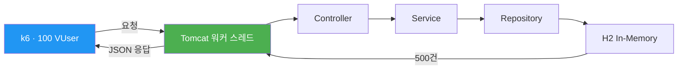
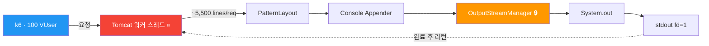
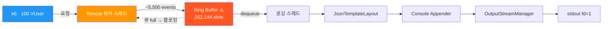
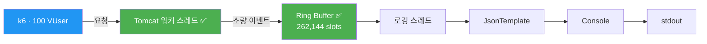
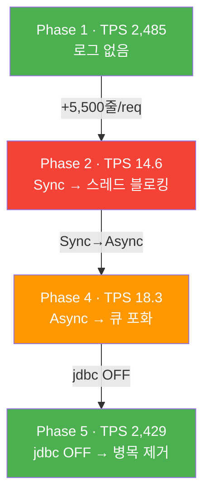

# 로깅 데이터 플로우

## Phase 1: Baseline (로깅 OFF)

설정: Root=WARN, jdbc=OFF → 로그 출력 없음

TPS 2,485. 로그 I/O가 없으므로 스레드가 요청 처리에만 사용됨.

---

## Phase 2: 동기(Sync) + Console (jdbc.resultset ON)

Tomcat 워커 스레드가 직접 Console에 쓰고, OutputStreamManager의 synchronized 블록에서 블로킹됨.

Log4j2 `OutputStreamManager`의 `synchronized` 블록에서 lock 경합이 발생한다 (스레드 덤프로 확인):

- `OutputStreamManager.writeBytes()`와 `flush()`가 `synchronized`로 보호됨
- Tomcat 워커 스레드들이 하나의 lock을 놓고 경합
- 1 요청 = ~5,500줄 → 쓰기 완료까지 수백ms 블로킹

TPS 14.6 (Baseline 대비 0.59%)

---

## Phase 4: 비동기(Async) + Console (jdbc.resultset ON)

Tomcat 워커 스레드는 Disruptor Ring Buffer에 넣고 리턴. 별도 로깅 스레드가 Console에 쓴다.

Ring Buffer 포화로 back-pressure 발생:

- 로깅 스레드 1개만 OutputStreamManager를 사용하므로 lock 경합은 없음
- 그러나 Console I/O 자체가 느려서 소비 속도 < 생산 속도
- 262,144 슬롯이 수초 내 포화 → Tomcat 워커 스레드가 enqueue에서 블로킹
- Phase 2와 병목 지점이 다름: lock 경합(Phase 2) vs 큐 포화(Phase 4)

TPS 18.3 (Phase 2 대비 +25%, Baseline 대비 0.74%)

---

## Phase 5: 비동기(Async) + Console (jdbc.resultset OFF)

jdbc 로그 차단으로 로그량이 대폭 감소하여 큐 포화가 발생하지 않음.

- jdbc.resultset=OFF → Logger 레벨 체크에서 즉시 반환, 로그 이벤트 객체 자체가 생성되지 않음 (요청당 ~5,500줄 → 0줄)
- Ring Buffer 여유 충분, back-pressure 없음
- Tomcat 워커 스레드가 I/O 대기 없이 요청 처리

TPS 2,429 (Baseline의 97.7%)

---

## 전체 비교 요약

| 비교 | TPS 변화 | 내용 |
|------|---------|------|
| Phase 2→4 (아키텍처 변경) | 14.6 → 18.3 (+25%) | Sync→Async 전환 효과 |
| Phase 4→5 (로그량 제거) | 18.3 → 2,429 (+13,200%) | jdbc.resultset OFF 효과 |
