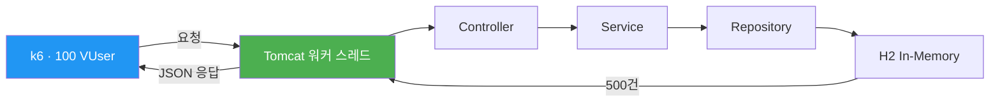
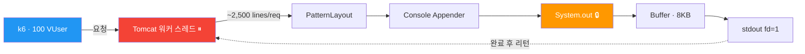
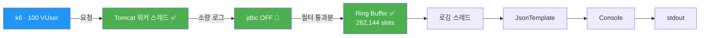

# 로깅 데이터 플로우

## Phase 1: Baseline (로깅 OFF)

> Root=WARN, jdbc=OFF → 로그 출력 없음

**결과: TPS 2,485** — 로그 I/O가 없으므로 스레드가 100% 비즈니스 로직에 집중.

---

## Phase 2: 동기(Sync) + Console (jdbc.resultset ON)

> Tomcat 워커 스레드가 직접 SYSTEM_OUT에 쓰고, 완료될 때까지 블로킹

**병목: `System.out` (synchronized)**

- `PrintStream.println()`은 내부적으로 `synchronized` 블록
- 200개 Tomcat 스레드가 하나의 lock을 놓고 경합
- 1 요청 = ~2,500줄 → 쓰기 완료까지 수백ms 블로킹

**결과: TPS 14.6** (Baseline 대비 0.59%)

---

## Phase 4: 비동기(Async) + Console (jdbc.resultset ON)

> Tomcat 워커 스레드는 Disruptor 큐에 넣고 리턴. 별도 스레드가 Console에 쓰기.

```mermaid
flowchart LR
    Client["k6 · 100 VUser"] -->|"요청"| T["Tomcat 워커 스레드"]
    T -->|"~2,500 events"| RB["Ring Buffer ⚠️\n262,144 slots"]
    RB -->|"dequeue"| LT["로깅 스레드"]
    LT --> JTL["JsonTemplateLayout"]
    JTL --> CA["Console Appender"]
    CA --> SOUT["System.out 🔒"]
    SOUT --> FD["stdout fd=1"]
    RB -.->|"큐 full → 블로킹"| T

    style T fill:#FF9800,color:#fff
    style RB fill:#FF5722,color:#fff
    style SOUT fill:#FF9800,color:#fff
    style Client fill:#2196F3,color:#fff
```

**병목: Ring Buffer 포화 → back-pressure**

- Disruptor Ring Buffer: **262,144 slots** (기본값)
- 100 VUser × 2,500 이벤트/요청 = 순식간에 포화
- 큐가 차면 Tomcat 워커 스레드도 enqueue에서 블로킹
- Console I/O 속도가 전체 처리량을 결정

**결과: TPS 18.3** (Phase 2 대비 +25%, 여전히 Baseline의 0.74%)

---

## Phase 5: 비동기(Async) + Console (jdbc.resultset OFF)

> jdbc 로그 차단 → 로그량 대폭 감소 → 큐 포화 없음

**병목 없음**

- jdbc.resultset OFF → 요청당 2,500줄 → **0줄**
- Ring Buffer 여유 충분, back-pressure 없음
- Tomcat 워커 스레드가 I/O를 전혀 기다리지 않음

**결과: TPS 2,429** (Baseline의 97.7% 회복)

---

## 전체 비교 요약

**핵심:**
- Phase 2→4 (아키텍처 변경): TPS 14.6 → 18.3 **(+25%)**
- Phase 4→5 (로그량 제어): TPS 18.3 → 2,429 **(+13,200%)**
- 아키텍처 최적화 < 로그량 제어
