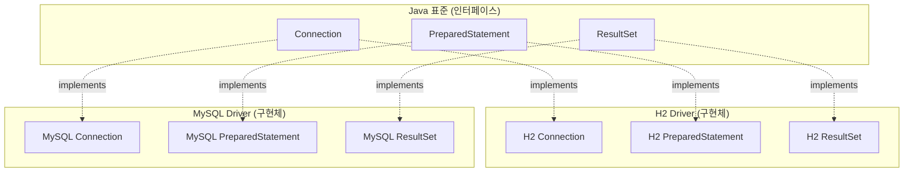
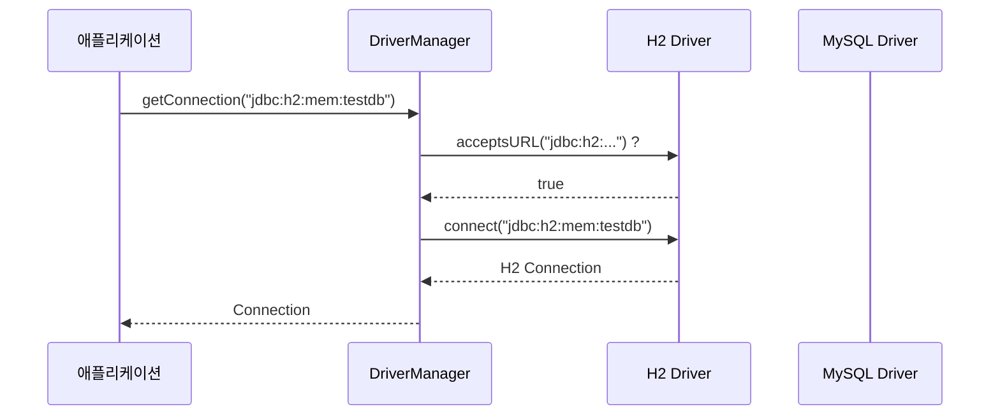
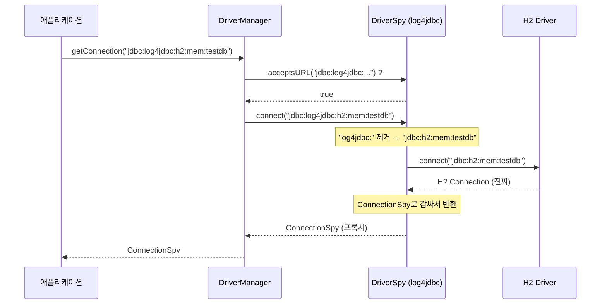
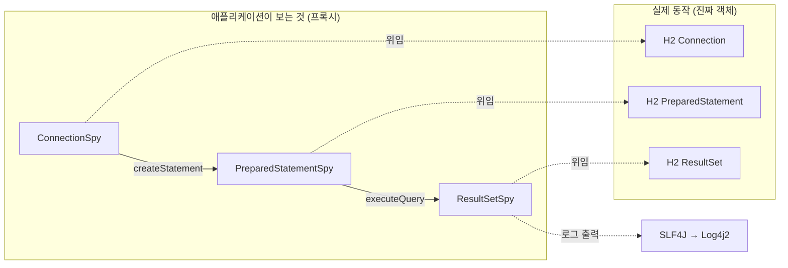
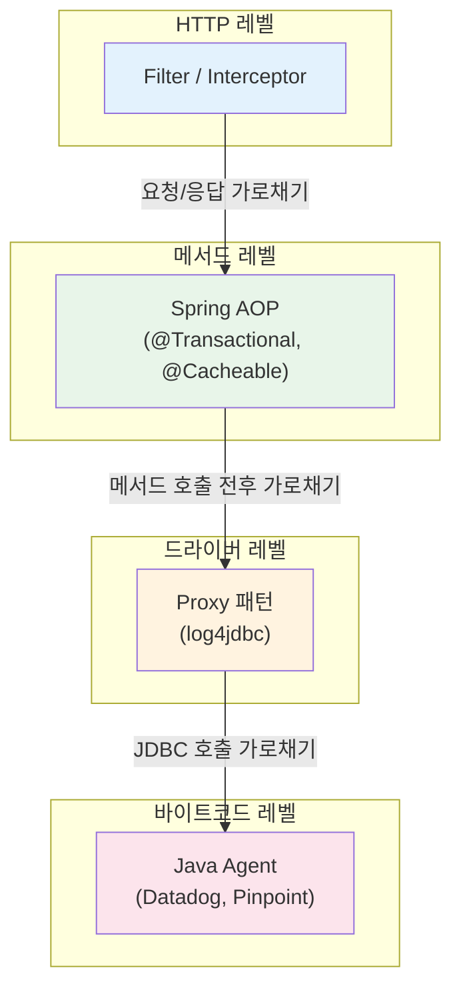

# JDBC 아키텍처와 log4jdbc 프록시 패턴

이 실험에서 사용한 log4jdbc의 동작 원리를 정리한다.

---

## 1. JDBC 아키텍처

### 인터페이스와 드라이버

JDBC는 Java가 정한 데이터베이스 접근 인터페이스 표준이다. 각 DB 벤더가 이 인터페이스의 구현체(드라이버)를 제공한다.



애플리케이션은 인터페이스(`Connection`, `ResultSet`)만 보고 코드를 작성한다. 드라이버를 바꾸면 코드 변경 없이 DB를 교체할 수 있다.

### DriverManager의 드라이버 선택

`DriverManager`가 등록된 드라이버들에게 URL을 보여주고, 처리 가능한 드라이버가 연결을 담당한다.



각 드라이버는 자기가 처리할 수 있는 URL 패턴을 갖고 있다:

| URL 패턴 | 드라이버 |
|----------|---------|
| `jdbc:h2:...` | H2 Driver |
| `jdbc:mysql:...` | MySQL Driver |
| `jdbc:postgresql:...` | PostgreSQL Driver |
| `jdbc:log4jdbc:...` | DriverSpy (log4jdbc) |

---

## 2. log4jdbc 프록시 패턴

### 동작 원리

log4jdbc의 `DriverSpy`도 JDBC Driver다. URL에 `log4jdbc:`가 포함되면 DriverSpy가 가로채고, 내부에서 실제 드라이버에게 위임한다.



### 프록시 체인

Connection → PreparedStatement → ResultSet 전체가 프록시로 감싸진다. 모든 JDBC 호출이 로깅된다.



### 프록시의 로깅 동작

ResultSetSpy를 예로 들면, 실제 메서드를 먼저 호출하고 그 결과를 로깅한다:

```java
// ResultSetSpy 내부 동작 (단순화)
class ResultSetSpy implements ResultSet {
    private ResultSet realResultSet;  // 진짜 H2 ResultSet

    public String getString(String column) {
        String result = realResultSet.getString(column);  // 1. 먼저 실행
        log("ResultSet.getString(" + column + ") returned " + result);  // 2. 결과 로깅
        return result;  // 3. 결과 그대로 반환
    }
}
```

결과를 알아야 `returned "user_1"`을 찍을 수 있으므로, 실행 → 로깅 순서다.

### 설정

```properties
# 원래 H2 직접 연결
spring.datasource.url=jdbc:h2:mem:testdb
spring.datasource.driver-class-name=org.h2.Driver

# log4jdbc가 H2를 래핑
spring.datasource.url=jdbc:log4jdbc:h2:mem:testdb
spring.datasource.driver-class-name=net.sf.log4jdbc.sql.jdbcapi.DriverSpy
```

URL에 `log4jdbc:`를 끼워 넣고 드라이버를 `DriverSpy`로 바꾸는 것만으로 전체 JDBC 호출이 프록시를 거친다. 애플리케이션 코드는 변경 없음.

---

## 3. log4jdbc 로거 종류

log4jdbc는 로깅 대상에 따라 여러 로거를 제공한다. 각 로거를 독립적으로 ON/OFF 할 수 있다.

### jdbc.sqltiming

SQL문과 실행 시간. 요청당 1~2줄.

```
jdbc.sqltiming - SELECT d.id, d.name, d.email, d.department, d.salary
                 FROM dummy_entity d {executed in 3 msec}
```

`log4jdbc.dump.sql.maxlinelength=90` (기본값)으로 긴 SQL은 자동 줄바꿈된다. PreparedStatement의 `?` 파라미터에 실제 값이 치환되어 출력된다.

### jdbc.resultset

`ResultSet.getXxx()` 호출을 하나하나 기록. 요청당 ~5,500줄.

```
jdbc.resultset - ResultSet.next() returned true
jdbc.resultset - ResultSet.getLong(id) returned 1
jdbc.resultset - ResultSet.getString(name) returned "user_1"
jdbc.resultset - ResultSet.wasNull() returned false
jdbc.resultset - ResultSet.getString(email) returned "user_1@test.com"
jdbc.resultset - ResultSet.wasNull() returned false
... (500건 × 행당 약 11줄 = ~5,500줄)
```

JDBC API 호출 단위로 기록하므로 사람이 읽는 용도가 아니다. 500건 조회 시 `next()` 500번 × 컬럼별 `getXxx()` + `wasNull()` 호출이 각각 1줄씩 기록된다.

### jdbc.resultsettable

조회 결과를 사람이 읽기 쉬운 표 형태로 출력.

```
jdbc.resultsettable -
|------|--------|-----------------|
| id   | name   | email           |
|------|--------|-----------------|
| 1    | user_1 | user_1@test.com |
| 2    | user_2 | user_2@test.com |
|------|--------|-----------------|
```

같은 데이터를 `jdbc.resultset`은 5,500줄로 기록하고, `jdbc.resultsettable`은 수십 줄의 표로 보여준다.

### jdbc.sqlonly

SQL문만 출력 (실행 시간 없음).

### 로거 조합 예시

```xml
<!-- 개발 환경: SQL + 결과 테이블 -->
<Logger name="jdbc.sqltiming" level="debug" additivity="false">
<Logger name="jdbc.resultsettable" level="debug" additivity="false">
<Logger name="jdbc.resultset" level="off" additivity="false"/>

<!-- 운영 환경: 전부 OFF 또는 sqltiming만 -->
<Logger name="jdbc.sqltiming" level="info" additivity="false">
<Logger name="jdbc.resultsettable" level="off" additivity="false"/>
<Logger name="jdbc.resultset" level="off" additivity="false"/>
```

---

## 4. Text vs JSON 포맷

같은 로그 이벤트에 대해 Log4j2의 Layout 설정으로 출력 포맷이 달라진다.

### Text (PatternLayout)

```
2026-02-20 14:32:15.123 DEBUG [http-nio-exec-1] jdbc.resultset - ResultSet.next() returned true
```

### JSON (JsonTemplateLayout)

```json
{"@timestamp":"2026-02-20T14:32:15.123Z","log.level":"DEBUG","message":"ResultSet.next() returned true","log.logger":"jdbc.resultset","process.thread.name":"http-nio-exec-1"}
```

JSON은 구조화된 필드를 key-value로 직렬화하므로 문자열이 더 길고 직렬화 연산이 추가된다. 그러나 실험 결과 Text(14.6 TPS) vs JSON(13.5 TPS)으로 차이가 7.5%에 불과했다. I/O 블로킹 시간(수백ms)에 비해 직렬화 비용(마이크로초)은 비중이 미미했다.

운영 환경에서 JSON을 쓰는 이유는 성능이 아니라 로그 수집기(Fluentd, Filebeat 등)가 파싱하기 쉽기 때문이다.

---

## 5. 호출 가로채기 패턴 비교

log4jdbc의 프록시 패턴은 "원본 코드를 수정하지 않고 호출을 가로채는" 여러 방법 중 하나다.



| 방식 | 예시 | 가로채는 대상 | 적용 방법 |
|------|------|-------------|----------|
| Filter / Interceptor | Spring `HandlerInterceptor` | HTTP 요청/응답 | 설정 등록 |
| AOP | `@Transactional` | Bean 메서드 호출 | 애노테이션 / 설정 |
| Proxy 패턴 | log4jdbc | JDBC 호출 | URL + 드라이버 변경 |
| Java Agent | Datadog APM | JVM 전체 바이트코드 | `-javaagent` JVM 옵션 |

공통점: 원본 코드를 수정하지 않고 호출을 가로챈다. 차이는 가로채는 레벨과 침투 범위다.
